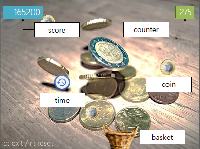
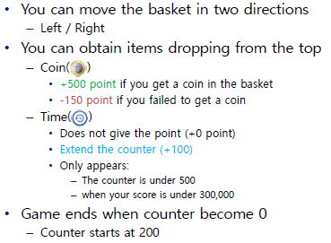
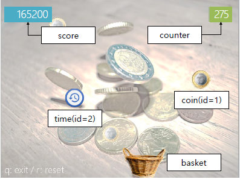
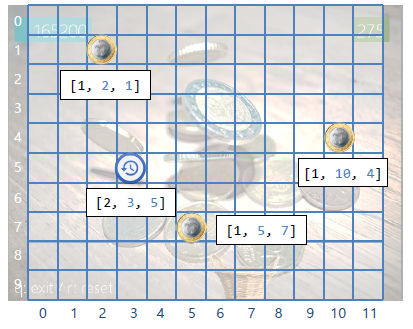
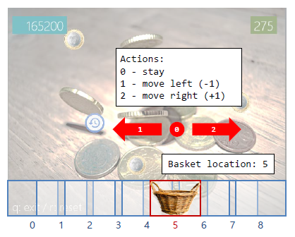

# Q-learning_coindrop
Reflex agent trained with <b>reinforcement learning.</b> This agent plays coin drop game implemented using pygame module. <b>CSI4108 @Yonsei Univ., Seoul, Republic of Korea</b> & Ref.: <b>CS188 Fall2018 @Stanford Univ., California, United States</b>
<i><b>Special thanks to: Lee, Gyeongbok / TA / alias_n@yonsei.ac.kr </b></i>

# Game Rules

